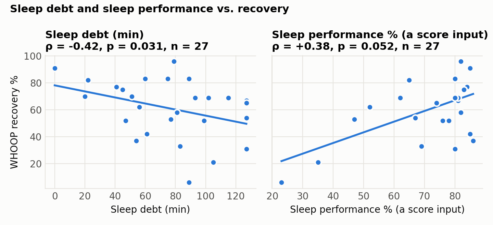
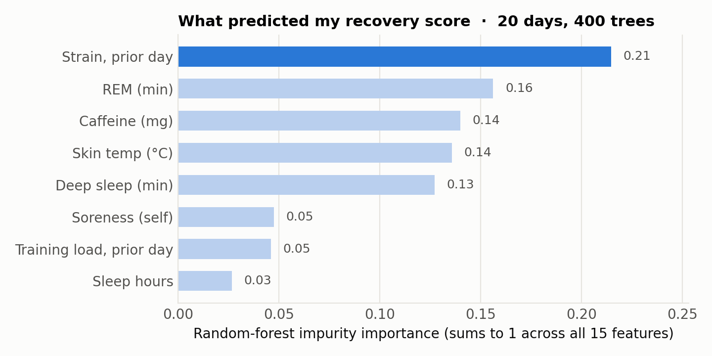
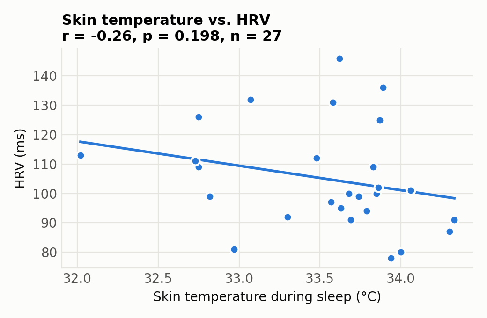

# What a month of my WHOOP data actually predicted (and the bug that changed the answer)

*Taylor C. Powell · Teapot Commons · September 2026*

*This article is for general educational purposes only and is not medical advice. It is not a substitute for professional diagnosis or treatment. Talk to a qualified healthcare provider before changing your diet, supplements, exercise, or medication.*

---

In June I exported a month of my own WHOOP data — recovery, HRV, resting heart rate, skin temperature, sleep staging, strain — and joined it to the training, caffeine, and readiness log I keep in an app I'm building. I wanted to know two things: which signals actually moved my recovery score, and whether my own readiness model was tracking WHOOP's.

The first pass produced a satisfying story. Deep sleep was the top predictor of recovery. Skin temperature was an early stress signal. My self-logged data "barely tracked the device." I wrote it all up.

Then I fixed a one-line bug in how the two datasets were joined, and about half of it evaporated. This article is the second pass: what survived, what didn't, and why the join key mattered more than any model.

Everything below is one person, 27 usable days, and a lot of tests. Treat every number as a hypothesis to re-test, not a result. The code and data are public so you can check me: **[github.com/Taylor-C-Powell/whoop-n-of-1](https://github.com/Taylor-C-Powell/whoop-n-of-1)**.

## The bug

A WHOOP export gives you one row per *physiological cycle*, with a cycle start time and a wake-onset time. The recovery score, HRV, RHR, and sleep fields in that row describe the **morning you woke up** — the wake-onset date. The cycle *start* time is the previous night's sleep onset, which is usually the day before.

My first analysis keyed everything to cycle start. Every WHOOP record was therefore labeled one day early relative to the morning I'd logged it in my app. When I compared "HRV I logged" to "HRV WHOOP recorded," the correlation was r = +0.04 — essentially nothing — and I concluded my self-logging was unreliable.

Keyed to wake onset, the same two columns correlate at r = +1.00 (n = 22).

The right-hand panel is not a discovery. It's a confession: the HRV and sleep numbers I "self-logged" each morning were WHOOP's own numbers, typed into my app by hand. Perfect agreement means the transcription and the alignment are correct, nothing more. But it does mean the first analysis wasn't measuring what I thought it was measuring, and it retroactively invalidated every self-log-versus-device claim in it.

Two smaller fixes rode along. Where a day had two "sleeps" — a nap, or a night WHOOP split in two — I now keep the longest one rather than averaging a 90-minute artifact with a full night. And "prior day" now means the previous calendar day, not the previous row in the table.

## What survived

**Yesterday's strain predicts today's recovery; today's doesn't.** This was the most robust finding in June and it got *stronger* under the corrected join: prior-day WHOOP strain vs. recovery, Spearman ρ = −0.59 (p = 0.002, n = 24). Same-day strain: ρ = +0.05. Self-logged training load (session RPE × minutes) shows the same lag, ρ = −0.43 the day after and nothing the same day. In a standardized regression, one standard deviation of prior-day strain costs about ten recovery points.

This is the expected direction — the recovery score is computed at wake, before the day's strain exists — but it's worth seeing how clean the lag is in the data. It's also the one relationship that a random forest, a rank correlation, and a linear model all agree on.

**Sleep debt hurts; sleep performance helps; raw sleep hours don't.** Sleep debt vs. recovery ρ = −0.42 (p = 0.03); sleep performance ρ = +0.38 (p = 0.05). Total hours asleep: ρ = −0.02. WHOOP's derived sleep metrics, which account for need and consistency, carried information that the raw duration didn't.

## What didn't

**Deep sleep was not the top predictor.** In June, deep-sleep minutes had a random-forest importance of 0.35 and I called it the headline. After the join fix it dropped to 0.13, fifth place, with a rank correlation to recovery of +0.18 (p = 0.38). The June result was real for the June table — but the June table was misaligned.

**Skin temperature vs. HRV weakened.** June: r = −0.50 (p = 0.02). Now: r = −0.26 (p = 0.20, n = 27). The direction held; the confidence didn't. I still think there's a signal here — a warm night with low HRV is a familiar pre-illness pattern — but this dataset can't carry that claim.

**Alcohol and caffeine: nothing usable.** June's regression put prior-night alcohol at about −7 recovery points per SD and caffeine at −5. The corrected regression gives alcohol +2 and caffeine +10. When the *sign* of a coefficient flips on a re-join, the coefficient was never there; with nine alcohol days and 21 rows, it can't be. I'm reporting this because the June numbers were the kind that get quoted.

**My own readiness score doesn't track WHOOP's.** The self-report composite from my app (subjective energy, soreness, plus the transcribed sleep and HRV) correlates with WHOOP recovery at r = −0.06. The version of the score that ingests device data directly did better in my June notes (r ≈ 0.5), but that comparison depends on code that isn't in this repo, and the two scores share inputs, so it's a fair-model check rather than validation. I'm leaving it out of the public claims until it can be reproduced from public files.

## One thing I don't understand

Respiratory rate during sleep correlates *positively* with recovery, ρ = +0.52 (p = 0.005). That is the strongest same-day correlation in the table and it's the opposite of what I'd expect — elevated respiratory rate is usually a strain or illness marker. With 15 same-day variables tested on 27 days, a single p = 0.005 is roughly what chance would hand me. I'm flagging it as unexplained and re-testing it as the data grows, not building on it.

## What I'd tell someone doing this with their own export

1. **Key WHOOP cycles to wake onset.** The recovery score belongs to the morning it was computed. Cycle start is the night before.
2. **De-duplicate days before you correlate.** Naps and split nights create extra cycles with their own tiny recovery scores.
3. **Lag on calendar days, not rows.**
4. **Decide what your self-logs actually are.** If you're transcribing the device, you have one measurement, not two.
5. **Re-run everything after a join fix, then compare.** The point of the exercise isn't the findings; it's finding out which findings were artifacts.

## Methods

Data: WHOOP export dated 2026-06-04 (31 physiological cycles, 29 with a recovery score; 27 distinct wake-onset days after de-duplication) merged with a daily log of training sessions (duration × session RPE), caffeine, alcohol, water, bodyweight, and a subjective readiness composite from 2026-04-14 to 2026-06-02. Overlap between the two sources: 22 days.

Analysis: Pearson correlation for continuous device-vs-device pairs, Spearman for everything else; standardized OLS (n = 21) on five pre-chosen features; a 400-tree random forest (min leaf 2, fixed seed) for impurity importance. No multiple-comparison correction was applied, which is one more reason to read the p-values as calibration, not belief. Python 3.11, pandas 3.0, scikit-learn 1.8, SciPy 1.17, matplotlib 3.10. `python analyze.py` regenerates every figure and number.

Evidence labels for the physiology referenced above: HRV and resting heart rate as day-to-day markers of training recovery — **moderate to limited** (reviews of athlete cohorts) [1,2]; session-RPE as a valid training-load measure — **moderate** [3]; wrist-worn wearables, WHOOP included, agreeing with polysomnography and ECG on sleep and HRV — **limited** (small validation studies) [4]. Nothing in this article about *my* data rises above **preliminary**: one subject, one month.

---

**Disclaimer.** This content is provided for educational and informational purposes only and does not constitute medical, nutritional, or professional health advice. Reading it does not create a provider–patient or coach–client relationship. The information is general and may not apply to you. Individual results vary widely. Consult a licensed physician or other qualified provider before starting, stopping, or changing any diet, supplement, training, or medication regimen — and especially before doing so if you are pregnant or nursing, are under 18, have a diagnosed medical condition, or take prescription medication. If you think you may have a medical emergency, call your local emergency number immediately.

*Author's note on tools: the analysis code was written by the author with AI assistance for refactoring and figure styling; every number was regenerated from the public data and reviewed by the author before publication.*

**Sources**

1. Plews DJ, Laursen PB, Stanley J, Kilding AE, Buchheit M. Training adaptation and heart rate variability in elite endurance athletes: opening the door to effective monitoring. Sports Med. 2013;43(9):773–781. doi:10.1007/s40279-013-0071-8
2. Buchheit M. Monitoring training status with HR measures: do all roads lead to Rome? Front Physiol. 2014;5:73. doi:10.3389/fphys.2014.00073
3. Foster C. Monitoring training in athletes with reference to overtraining syndrome. Med Sci Sports Exerc. 1998;30(7):1164–1168. doi:10.1097/00005768-199807000-00023
4. Miller DJ, Sargent C, Roach GD. A validation of six wearable devices for estimating sleep, heart rate and heart rate variability in healthy adults. Sensors (Basel). 2022;22(16):6317. doi:10.3390/s22166317
