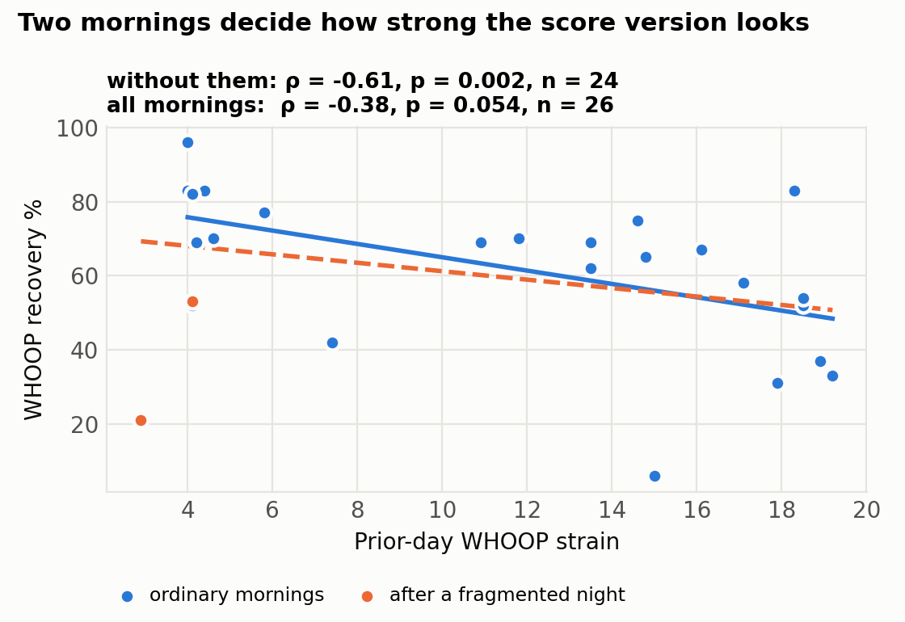

# What a month of my WHOOP data actually predicted (and the bugs that changed the answer)

*Taylor C. Powell · Teapot Commons · September 2026*

*This article is for general educational purposes only and is not medical advice. It is not a substitute for professional diagnosis or treatment. Talk to a qualified healthcare provider before changing your diet, supplements, exercise, or medication.*

---

In June I exported a month of my own WHOOP data — recovery, HRV, resting heart rate, skin temperature, sleep staging, strain — and joined it to the training, caffeine, and readiness log I keep in an app I'm building. I wanted to know two things: which signals actually moved my recovery score, and whether my own readiness model was tracking WHOOP's.

The first pass produced a satisfying story. Deep sleep was the top predictor of recovery. Skin temperature was an early stress signal. My self-logged data "barely tracked the device." I wrote it all up.

Then I fixed a one-line bug in how the two datasets were joined, and about half of it evaporated. That was the second pass, and I wrote that up too. Before sending it anywhere I had the repository audited line by line, with every number re-derived independently from the raw files. The audit found a second alignment problem, this time inside my headline result. This article is the third pass: what survived all of it, what didn't, and why the join keys mattered more than any model.

Everything below is one person, 27 usable days, and a lot of tests. Treat every number as a hypothesis to re-test, not a result. The code and data are public so you can check me: **[github.com/Taylor-C-Powell/whoop-n-of-1](https://github.com/Taylor-C-Powell/whoop-n-of-1)**.

## The bug I found

A WHOOP export gives you one row per *physiological cycle*, with a cycle start time and a wake-onset time. The recovery score, HRV, RHR, and sleep fields in that row describe the **morning you woke up** — the wake-onset date. The cycle *start* time is the previous night's sleep onset, which is usually the day before.

My first analysis keyed everything to cycle start. In 18 of the 29 scored cycles the cycle began on an earlier calendar date than the morning it describes, nearly always because I fell asleep before midnight, so that key labeled the record a day early relative to the morning I'd logged it in my app. In the other 11 the cycle began after midnight, so the wrong key landed on the right day by accident. A uniform one-day shift would have shown up as a clean lag and been easy to spot. A shift that applies to some nights and not others just looks like noise: when I compared "HRV I logged" to "HRV WHOOP recorded," the correlation was r = +0.04, and I concluded my self-logging was unreliable.

Keyed to wake onset, the same two columns correlate at r = +1.00 (n = 22).

The hollow points in the left panel are cycles that began after midnight: the wrong key left them sitting on the diagonal while it scattered everything else.

The right-hand panel is not a discovery. It's a confession: the HRV and sleep numbers I "self-logged" each morning were WHOOP's own numbers, typed into my app by hand. They match the export exactly on 13 of 22 days and are off by 1 ms on the other nine. Agreement that tight means the transcription and the alignment are correct, nothing more. But it does mean the first analysis wasn't measuring what I thought it was measuring, and it retroactively invalidated every self-log-versus-device claim in it.

Two smaller fixes rode along. Where a day had two "sleeps" — a nap, or a night WHOOP split in two — I keep the longest one rather than averaging a 90-minute artifact with a full night. And "prior day" means the previous calendar day, not the previous row in the table.

## The bug the audit found

A cycle row carries two kinds of data. The recovery and sleep fields describe the sleep that ended at wake onset. *Day Strain* describes everything from cycle start to cycle end, which is the waking day that follows. On an ordinary night those share a date, so keying the whole row to wake onset works.

Twice in this month they didn't. WHOOP recorded no sleep at the start of a cycle (the nights of May 12 and May 31), the cycle ran long, and the only scored sleep in the row came near its end. For those rows the recovery score belongs to the wake date and the strain belongs to the day *before* it.

My corrected join keyed both to the wake date. That handed June 2 a strain of 2.9 that was really June 1's; June 2's own strain, 13.5, sat in a row my de-duplication dropped. It also left May 13 and June 1 with no strain at all, which silently removed the mornings of May 14 and June 2 from the lag analysis. Those happen to be two of the worst-slept mornings in the dataset.

Strain is now keyed to the waking day each cycle covers (the date of the cycle's midpoint), recovery stays keyed to wake onset, and each rule has a test, including one for those two rows. The consequence is in the next section.

The audit caught one more thing of the same family. My regression used *same-day* caffeine as a predictor of a score that is computed at wake, hours before the coffee. Every logged behaviour now enters with a one-day lag, and there is a test for that too.

## What survived

**Yesterday's strain shows up in this morning's HRV; today's doesn't.** Prior-day WHOOP strain vs. morning HRV: Spearman ρ = −0.59 (p = 0.001, n = 26; bootstrap 95% interval −0.83 to −0.25). Same-day strain: ρ = +0.22 (p = 0.28). Leaving out the two fragmented mornings barely moves it (ρ = −0.65). Self-logged training load (session RPE × minutes) shows the same lag against HRV, ρ = −0.51 (p = 0.013, n = 23), and resting heart rate moves the other way, as it should (ρ = +0.42, p = 0.033).

This is the expected direction [1,2], and the ordering is the point: the morning reading exists before the day's strain does, so only the lagged version can be an effect of training.

**Against the recovery score, the same relationship hangs on two mornings.** In the version of this article I almost sent out, the headline was prior-day strain vs. recovery, ρ = −0.59. That number came from the join described above. With strain keyed correctly and every morning included it is ρ = −0.38 (p = 0.054, n = 26), with a bootstrap interval from −0.79 to +0.09. Without the two fragmented mornings it is ρ = −0.61 (p = 0.002, n = 24).

Both of those mornings followed low-strain days, and both had low recovery for a reason that had nothing to do with training: I had slept 3.6 and 3.3 hours, and sleep performance (47% and 35%) is one of the score's inputs. The composite did what it is designed to do. It is simply a noisier target for a question about training load than the raw signal underneath it. In a standardized regression on predictors that precede the score, one SD of prior-day strain costs about twelve recovery points, with a 95% interval from −23 to −1 (n = 23).

**Sleep debt tracks recovery; raw sleep hours don't.** Sleep debt vs. recovery ρ = −0.42 (p = 0.03). Total hours asleep: ρ = −0.02 on their own, and about +9 points per SD in the regression with an interval that nearly touches zero (+0.3 to +18.3); I wouldn't lean on either. Sleep performance also correlates (ρ = +0.38, p = 0.05), but that one is partly built in, which brings up a caveat for this whole section.

WHOOP documents the recovery score as a function of HRV, resting heart rate, respiratory rate, sleep, skin temperature and blood oxygen. In my month, HRV, RHR, respiratory rate and sleep performance alone reproduce 81% of the score's variance in a linear fit. So a correlation between recovery and one of its own inputs is not a finding about my physiology; it is a partial reading of the formula. Sleep debt is not independent of it either, since it feeds sleep need, the denominator of sleep performance. That is why the lag analysis above leads with HRV, which is a measurement, rather than with the score, which is a model.

## What didn't

**Deep sleep was not the top predictor.** In June, deep-sleep minutes had a random-forest importance of 0.35 and I called it the headline. In the corrected analysis it averages 0.11, fifth of eleven features, with a rank correlation to recovery of +0.18 (p = 0.38). The June result was real for the June table — but the June table was misaligned.

The forest now only sees variables that exist before the score does, and it is averaged over 25 seeds, because with 19 rows a single seed's ordering means little. Prior-day strain and REM minutes tie at the top (0.20 each) and swap places depending on the seed. REM has no monotonic relationship with recovery at all (ρ = +0.02), so I read its importance as a forest fitting noise in 19 rows, not as a second finding. In the second pass I wrote that a rank correlation, a linear model and a random forest all agreed on strain. Two of the three still do.

**Skin temperature vs. HRV weakened.** June: r = −0.50 (p = 0.02). Now: r = −0.26 (p = 0.20, n = 27). The direction held; the confidence didn't. I still think there's a signal here — a warm night with low HRV is a familiar pre-illness pattern — but this dataset can't carry that claim.

**Alcohol and caffeine: nothing usable.** June's regression put prior-night alcohol at about −7 recovery points per SD and caffeine at −5. Neither survives, for reasons that have nothing to do with statistical subtlety. My daily log has nine alcohol days, but only two of them fall inside the WHOOP window, and no model can estimate an effect from two days. And the caffeine in that regression was same-day caffeine. In the second pass it came out at +10 points per SD with an interval that excluded zero, and I waved it away as a sign flip. It wasn't noise. It was a variable measured after the outcome, which says something about when I drink coffee and nothing about what coffee does. With prior-day caffeine the coefficient is −0.5 (interval −12 to +11) and the rank correlation is +0.06. I'm reporting this because the June numbers were the kind that get quoted.

**My own readiness score doesn't track WHOOP's.** The self-report composite from my app (subjective energy, soreness, plus the transcribed sleep and HRV) correlates with WHOOP recovery at r = −0.06. The version of the score that ingests device data directly did better in my June notes (r ≈ 0.5), but that comparison depends on code that isn't in this repo, and the two scores share inputs, so it's a fair-model check rather than validation. I'm leaving it out of the public claims until it can be reproduced from public files.

## One thing I don't understand

Respiratory rate during sleep correlates *positively* with recovery, ρ = +0.52 (p = 0.005). Apart from HRV it is the strongest same-morning correlation in the table, and it's the opposite of what I'd expect — elevated respiratory rate is usually a strain or illness marker. Respiratory rate is one of the score's documented inputs, so some relationship is built in, but I'd expect the built-in direction to be negative. With more than thirty correlations computed on 27 days, a single p = 0.005 is roughly what chance would hand me. I'm flagging it as unexplained and re-testing it as the data grows, not building on it.

## What I'd tell someone doing this with their own export

1. **Key recovery and sleep to wake onset.** The recovery score belongs to the morning it was computed. Cycle start is the night before, except on the nights it isn't.
2. **Key strain to the waking day the cycle covers.** It is usually the same date as the wake onset. It isn't when a night goes unrecorded, and those are exactly the rows you won't think to check.
3. **De-duplicate days before you correlate, and flag the days you de-duplicated.** Naps and split nights create extra cycles with their own tiny recovery scores, and the mornings they come from are your outliers.
4. **Lag on calendar days, not rows.**
5. **Check that every predictor exists before the outcome does.** The score is computed at wake. Anything you did that day came after it.
6. **Know which variables are inputs to the score you're predicting.** Correlating a composite with its own ingredients will always "work."
7. **Decide what your self-logs actually are.** If you're transcribing the device, you have one measurement, not two.
8. **Re-run everything after a join fix, then compare. Then have someone else re-derive it.** The point of the exercise isn't the findings; it's finding out which findings were artifacts. I found one bug on my own and needed an audit to find the next.

## Methods

Data: WHOOP export dated 2026-06-04 (31 physiological cycles, 29 with a recovery score; 27 distinct wake-onset days after de-duplication, two of them flagged as fragmented) merged with a daily log of training sessions (duration × session RPE), caffeine, alcohol, water, bodyweight, and a subjective readiness composite from 2026-04-14 to 2026-06-02. Overlap between the two sources: 22 days. Sessions logged without an RPE (three days) are treated as missing training load, not as rest days. The strap-activation day, which the export records as a cycle with no sleep and zero strain, is excluded.

Analysis: Pearson correlation for the self-log-versus-device checks and for skin temperature vs. HRV, Spearman for everything else; percentile bootstrap intervals from 2,000 resamples, with days resampled as if independent, so the intervals are optimistic; standardized OLS (n = 23) on five pre-chosen predictors that precede the score; random-forest impurity importance averaged over 25 seeds (200 trees each, min leaf 2). No multiple-comparison correction was applied, which is one more reason to read the p-values as calibration, not belief. `python analyze.py` regenerates every figure and number, and `python -m pytest` checks the alignment rules, including the two edge-case rows described above.

Evidence labels for the physiology referenced above: HRV and resting heart rate as day-to-day markers of training recovery — **moderate to limited** (reviews of athlete cohorts) [1,2]; session-RPE as a valid training-load measure — **moderate** [3]; wrist-worn wearables, WHOOP included, agreeing with polysomnography and ECG on sleep and HRV — **limited** (small validation studies) [4]. Nothing in this article about *my* data rises above **preliminary**: one subject, one month.

---

**Disclaimer.** This content is provided for educational and informational purposes only and does not constitute medical, nutritional, or professional health advice. Reading it does not create a provider–patient or coach–client relationship. The information is general and may not apply to you. Individual results vary widely. Consult a licensed physician or other qualified provider before starting, stopping, or changing any diet, supplement, training, or medication regimen — and especially before doing so if you are pregnant or nursing, are under 18, have a diagnosed medical condition, or take prescription medication. If you think you may have a medical emergency, call your local emergency number immediately.

*Author's note on tools: the analysis code was written with AI assistance, and the September 2026 audit that found the strain-attribution and predictor-timing problems was AI-assisted as well, as were the fixes and the revisions to this text that followed from it. Every number here is regenerated from the public data by `analyze.py`, and the alignment rules are covered by the tests in `tests/`.*

**Sources**

1. Plews DJ, Laursen PB, Stanley J, Kilding AE, Buchheit M. Training adaptation and heart rate variability in elite endurance athletes: opening the door to effective monitoring. Sports Med. 2013;43(9):773–781. doi:10.1007/s40279-013-0071-8
2. Buchheit M. Monitoring training status with HR measures: do all roads lead to Rome? Front Physiol. 2014;5:73. doi:10.3389/fphys.2014.00073
3. Foster C. Monitoring training in athletes with reference to overtraining syndrome. Med Sci Sports Exerc. 1998;30(7):1164–1168. doi:10.1097/00005768-199807000-00023
4. Miller DJ, Sargent C, Roach GD. A validation of six wearable devices for estimating sleep, heart rate and heart rate variability in healthy adults. Sensors (Basel). 2022;22(16):6317. doi:10.3390/s22166317
