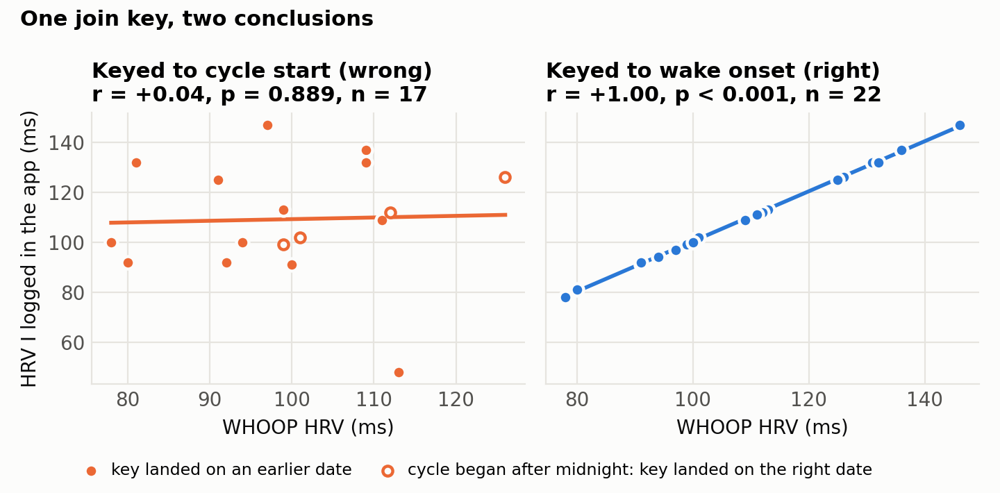
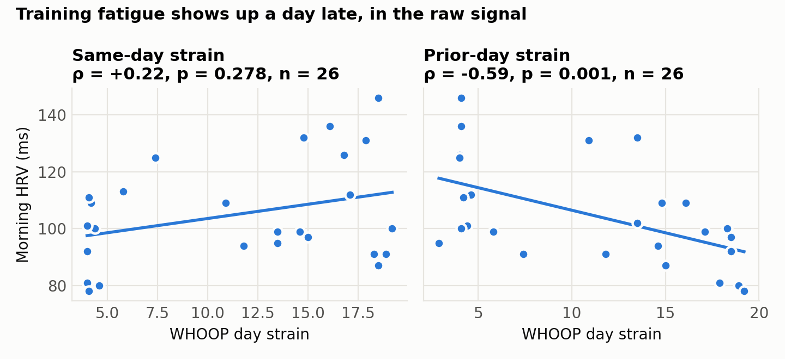

# whoop-n-of-1

**One person, one month of WHOOP data, and the join bugs that changed the findings.**

[](https://github.com/Taylor-C-Powell/whoop-n-of-1/actions/workflows/ci.yml)


**[Read the article](ARTICLE.md)** · [Results tables](results.md) · [Run it](#run-it) · [Alignment rules](#the-alignment-rules) · [Honest limits](#honest-limits)



The same two HRV columns, joined two ways. Keyed to cycle start, my self-logged HRV and WHOOP's HRV correlate at r = +0.04. Keyed to wake onset, r = +1.00. A WHOOP cycle's recovery, HRV, RHR, and sleep fields describe the morning you woke up, not the night the cycle started. My first join put 18 of 29 records on an earlier date and left the other 11 in place, which scattered the pairing instead of shifting it cleanly. Fixing that made about half of my original findings evaporate. An independent audit of the fixed version then found a second alignment problem inside the headline result. This repository is the third pass.

It reproduces every number and figure in the article
[*What a month of my WHOOP data actually predicted (and the bugs that changed the answer)*](ARTICLE.md).
It exists so the analysis can be checked, not just read.

## Findings at a glance

| Claim | First pass (June, misaligned) | Now | Verdict |
|---|---|---|---|
| Yesterday's strain lowers this morning's HRV | not tested | ρ = −0.59 (p = 0.001, n = 26; 95% CI −0.83 to −0.25); same-day ρ = +0.22 | **Survived** every handling I tried |
| Yesterday's strain lowers today's recovery score | June's most robust finding | ρ = −0.38 (p = 0.054, n = 26) with every morning; ρ = −0.61 (p = 0.002, n = 24) without two fragmented mornings | Depends on two mornings |
| Sleep debt tracks recovery, raw hours don't | — | debt ρ = −0.42 (p = 0.03); hours ρ = −0.02 | **Survived**, with a caveat: the score is built partly from sleep |
| Deep sleep is the top recovery predictor | RF importance 0.35, ranked first | 0.11, fifth of eleven; ρ = +0.18 (p = 0.38) | Did not survive |
| Skin temperature tracks HRV | r = −0.50 (p = 0.02) | r = −0.26 (p = 0.20, n = 27) | Weakened |
| Alcohol and caffeine cost recovery points | −7 and −5 points per SD | two alcohol days in the window; prior-day caffeine −0.5 points per SD (95% CI −12 to +11) | Not usable |
| My self-logged HRV barely tracks the device | r = +0.04 (n = 17) | r = +1.00 (n = 22); the "self-log" was a transcription of the device | The first bug |
| My self-report readiness score tracks WHOOP recovery | — | r = −0.06 (n = 22) | Did not hold |
| Respiratory rate rises with recovery | — | ρ = +0.52 (p = 0.005) | Unexplained; about what chance hands you across thirty-odd tests |

Full tables are in [`results.md`](results.md); the reasoning is in the [article](ARTICLE.md).



The morning HRV reading exists before the day's strain does, so only the lagged relationship can be an effect of training, and it is the one that holds. Against the composite recovery score the same relationship is shakier, because the score is also built from sleep performance and two badly slept mornings followed easy days ([Figure 6](figures/fig6_score_vs_signal.png)). In this month HRV, RHR, respiratory rate and sleep performance reproduce 81% of the recovery score in a linear fit, so the analysis leads with the measurement rather than the model.

## Run it

macOS / Linux:

```bash
python -m venv .venv && source .venv/bin/activate
pip install -r requirements-dev.txt
python -m pytest -q
python analyze.py
```

Windows (PowerShell):

```powershell
python -m venv .venv; .venv\Scripts\Activate.ps1
pip install -r requirements-dev.txt
python -m pytest -q
python analyze.py
```

`analyze.py` reads `data/`, writes `figures/*.png`, `results.md`, and `results.json`, and prints the results tables. It takes about ten seconds. `requirements.txt` alone is enough if you only want to run the analysis.

Every push runs the tests and then re-runs the analysis on a clean machine, and the build fails if `results.md` or `results.json` come out different from the committed files. The same two files also come out byte-identical on Windows (Python 3.13, pandas 2.2, scikit-learn 1.8) and Linux (Python 3.12, pandas 3.0, scikit-learn 1.9).

## The alignment rules

Each rule has a test in [`tests/test_alignment.py`](tests/test_alignment.py).

1. **Recovery and sleep are keyed to the wake-onset date.** The recovery score, HRV, RHR, and sleep fields in a cycle row describe the morning you woke up. Keying to cycle start moves a record to an earlier date whenever the cycle began before midnight and leaves it alone otherwise. Section A of the results shows the same two HRV columns at r = +0.04 under the wrong key and r = +1.00 under the right one.
2. **Strain is keyed to the waking day the cycle covers** (the date of the cycle's midpoint). Usually that is the wake-onset date too. When WHOOP records no sleep at the start of a cycle, the row's strain belongs to the day *before* its wake date. That happened twice in this export, and keying those rows' strain to the wake date is the bug the audit found.
3. **One scored sleep per wake date: the longest.** Naps and split nights produce extra cycles with their own short sleep and tiny recovery score. Mornings with more than one scored sleep are flagged as fragmented, and the lag analysis is reported with and without them.
4. **"Prior day" means the previous calendar day**, computed by shifting dates, not by taking the previous row.
5. **Nothing measured after the score may predict it.** Recovery is computed at wake, so caffeine, alcohol, water and training load enter every model with a one-day lag.

## What's in here

| Path | What it is |
|---|---|
| `data/whoop/physiological_cycles.csv` | The WHOOP export (31 cycles, May 5 – Jun 4 2026): recovery, HRV, RHR, skin temp, SpO₂, strain, sleep staging |
| `data/whoop/sleeps.csv`, `data/whoop/workouts.csv` | The rest of the export, for anyone who wants to go further |
| `data/daily_master.csv` | My daily log for the same window: training sessions (duration × session RPE), caffeine, alcohol, water, bodyweight, and a self-report readiness composite |
| `analyze.py` | The whole analysis: two join keyings, same-morning and lagged correlations with bootstrap intervals, standardized OLS, random-forest importance averaged over seeds, six figures |
| `tests/test_alignment.py` | Twelve tests for the five rules above, including the two edge-case rows in the real export |
| `results.md` / `results.json` | Regenerated output; the article quotes from these |
| `ARTICLE.md` | The write-up |

The WHOOP journal entries (yes/no behaviour questions) are not included; they add nothing the daily log doesn't already have and they are the most personal part of the export.

## How this differs from my June notes

My internal June write-up reported deep sleep as the top recovery predictor (RF importance 0.35), skin temp vs HRV at r = −0.50, alcohol at about −7 recovery points per SD, and self-logged HRV vs device at r = 0.68 after a partial fix. This repo does not reproduce those numbers, and the article says so. The differences come from the alignment rules above (the June re-run fixed the join key but still averaged duplicate cycles and lagged by row) and from the readiness snapshot in `daily_master.csv`, which predates a June 4 recompute in the app. The first public version of this repo also reported prior-day strain vs. recovery at ρ = −0.59; that figure came from keying strain to the wake date and is superseded by the table above. Where any of these disagree, this repo is the version I stand behind, because it is the one anyone can run.

## Honest limits

- n = 1. Nothing here generalizes to anyone else.
- 27 usable device days; 22 overlap with the daily log; the regression uses 23 rows and the random forest 19.
- More than thirty correlations were computed with no multiple-comparison correction. At least one "significant" result is expected by chance, and one (respiratory rate, ρ = +0.52) looks like it.
- Consecutive days are autocorrelated, so every p-value and every bootstrap interval is optimistic.
- The recovery score is computed from several of the variables it is correlated with here (HRV, RHR, respiratory rate, sleep, skin temperature, blood oxygen). Those correlations are partly built in.
- Two mornings followed fragmented nights. They are kept, flagged, and the results that depend on them say so.
- The "self-logged" HRV and sleep hours were transcribed from WHOOP each morning. They are a transcription check, not an independent measurement.

## License

Code: MIT. Data: released for non-commercial analysis and reproduction of this article; it is my own physiological data and I'd ask that it not be redistributed as part of any aggregated dataset.

## Author

Taylor C. Powell — [linkedin.com/in/taylor-c-powell](https://www.linkedin.com/in/taylor-c-powell/) · taylorp661@gmail.com
